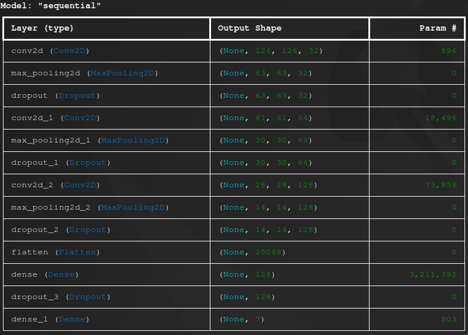
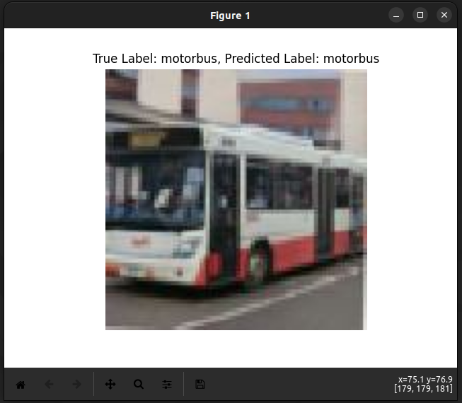

# Captcha Classification
A multi-class classification model, CNN-based, using deep learning to classify captcha images into various categories.
 
---

### Summary Example


### Prediction Example


---

## Requirements
Python 3.x, TensorFlow, Matplotlib

## Installation
1. Clone this repository:
``` bash
git clone https://github.com/Blakley/captcha-classification
```

2. Install the required dependencies:
```bash
pip install -r requirements.txt
```
## Usage
1. **Setup** the dataset:
    - Download the captcha dataset from [Kaggle](https://www.kaggle.com/datasets/aneeshtickoo/hcaptcha-dataset/data).
    Extract the dataset files to the dataset/ directory in the project root.

2. **Training** the model:
    - Run the main.py script to train the classification model:
    ```bash
    python3 model.py
    ```

3. **Testing** the model:
    - Once the model is trained, you can make predictions on captcha images using the saved model.